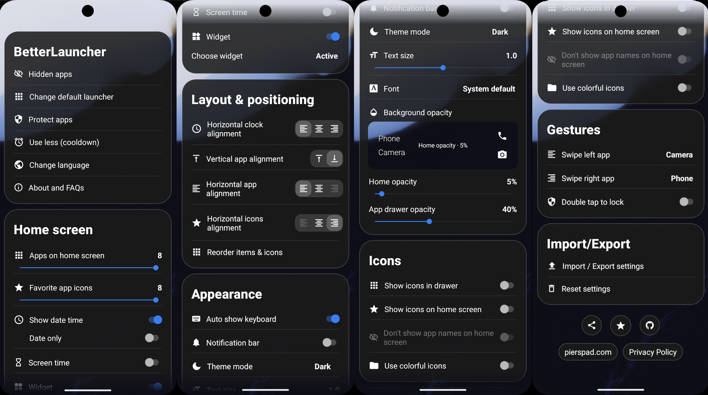
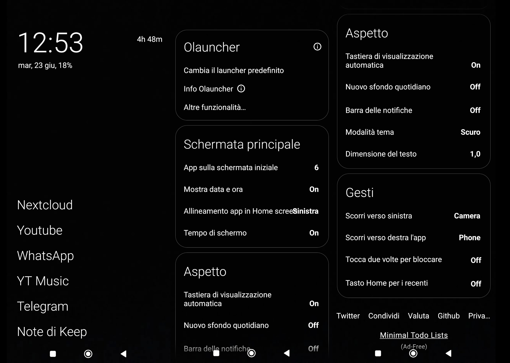
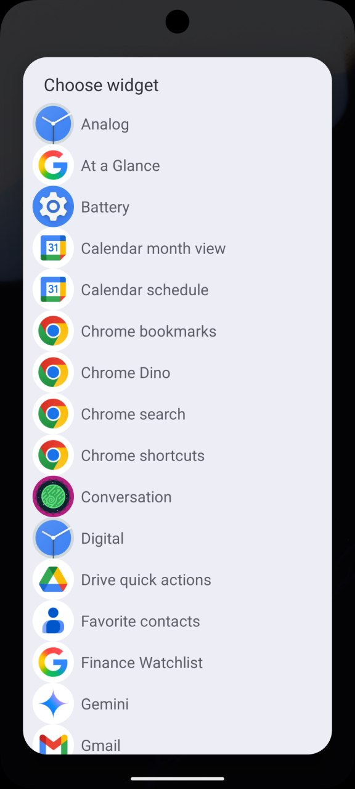
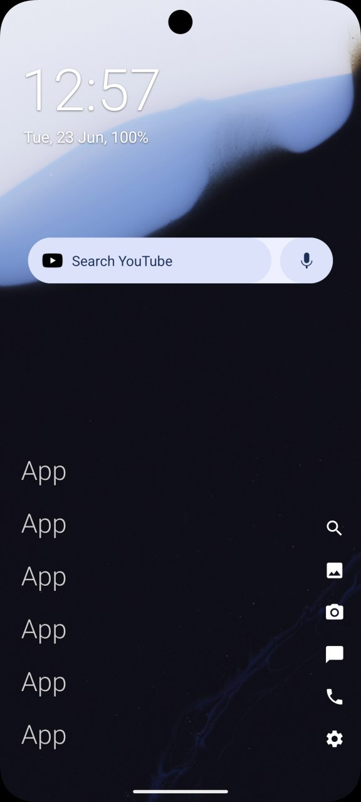
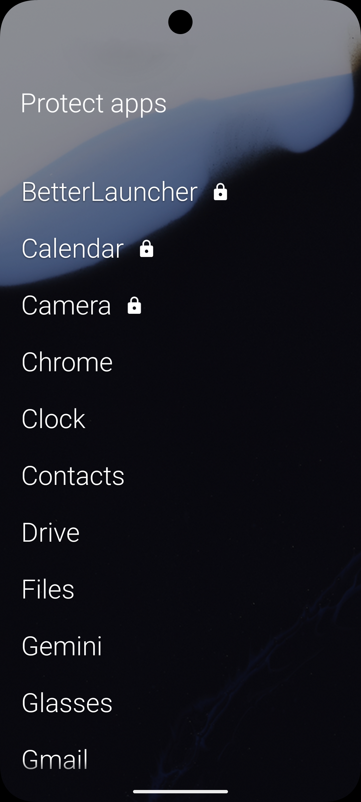

# BetterLauncher

Hard fork of [Olauncher](https://github.com/tanujnotes/olauncher) featuring additional customizations, a polished UI/UX, and a clean, popup-free experience.

### BetterLauncher vs. Olauncher

#### BetterLauncher (Home Screen & Settings)

#### Olauncher (Original Home Screen & Settings)

### Install using 
[Play Store](https://play.google.com/store/apps/details?id=app.olauncher) or the [latest APK](https://github.com/pierspad/BetterLauncher/releases/).

## What you can do now (that was not possible in Olauncher)
- Add a row of customizable shortcut icons on the home screen.
- Place and configure system widgets directly on the home screen.
- Organize apps into custom folders and groups.
- Lock sensitive apps using a PIN, pattern, password, or biometrics.
- Set escalating timers and cooldowns on distracting apps.
- Search for contacts and Android system settings directly from the app drawer, using customizable search algorithms.
- Drag to reorder home screen apps and shortcuts instead of using a settings dialog.
- Import custom fonts (.ttf/.otf) and set the language independently of the system.
- Export and import your settings via file or clipboard.
- Use monochrome icon packs (via Lawnicons).
- Read the text better with improved contrast and shortcut icons that scale with text size.
- Navigate settings easier with redesigned toggle switches, alignment controls, and size sliders.
- Preview your actual wallpaper in real-time while adjusting background opacity in settings.
- Place widgets reliably without dead/broken widget states or system pickers getting in the way.
- Use the launcher without premium version reminders, popups, or ads.
- See visual indicators for locked apps and groups in the drawer.
- Reset settings or cycle themes with one tap.

### Home Screen Widget Support
You can easily select and place any standard system widget directly on your home screen.

  
  &nbsp;&nbsp;&nbsp;&nbsp;
  

### Secure App Locking
Protect sensitive applications using your device's native lock credentials.

  

### Configurable App Search Modes
BetterLauncher includes an intelligent app drawer search engine with 3 customizable search modes (accessible via the search options icon in the app drawer):

- **Smart (Default)**:
  - **Multi-word queries (with spaces)**: Space-separated terms match word prefixes (e.g. `Proton M` matches *Proton Mail*, while `Proton L` avoids false positives like *Proton Mail* or *Proton Calendar*).
  - **Single-word queries (without spaces)**: Supports initialisms (e.g. `pm` -> *Proton Mail*, `ytm` -> *YouTube Music*), word prefixes, and fuzzy matching (e.g. `rdd` -> *Reddit*).
- **Word Prefix**: Every query term must match the start of a word in the app label (e.g. `p m` -> *Proton Mail*).
- **Loose Fuzzy**: Subsequence matching allowing characters anywhere in the app label.

| Query | Target App | Smart Mode | Word Prefix | Loose Fuzzy |
| :--- | :--- | :---: | :---: | :---: |
| `Proton M` | **Proton Mail** | ✅ Match | ✅ Match | ✅ Match |
| `Proton L` | **Proton Mail** | ❌ Excluded | ❌ Excluded | ✅ Match ('l' in Mail) |
| `pm` | **Proton Mail** | ✅ Match (Initials) | ❌ Excluded | ✅ Match |
| `rdd` | **Reddit** | ✅ Match (Fuzzy) | ❌ Excluded | ✅ Match |

License: [GNU GPLv3](https://www.gnu.org/licenses/gpl-3.0.en.html)

Personal website: [pierspad.com](https://www.pierspad.com)
