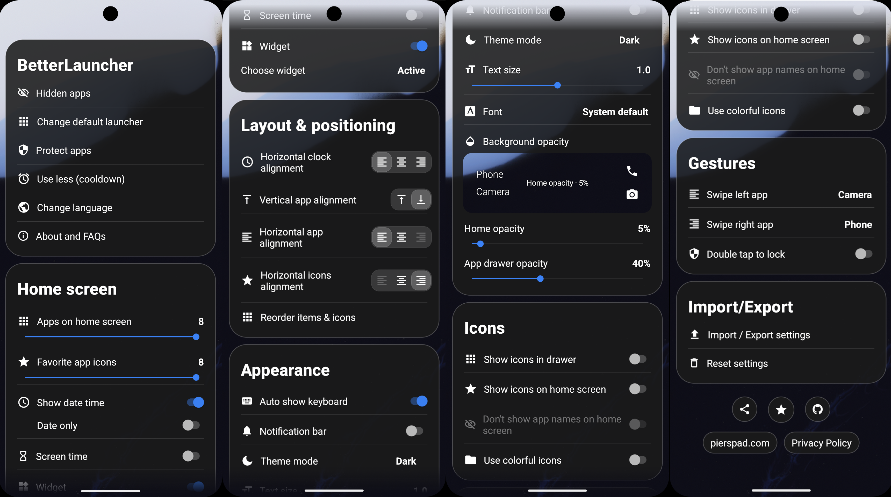
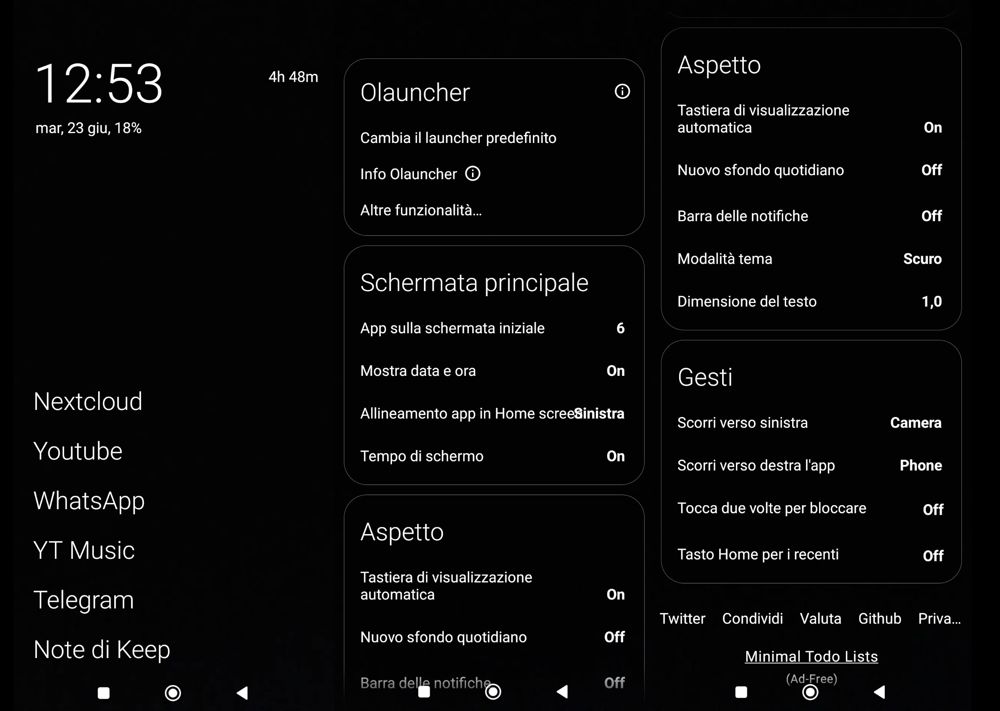
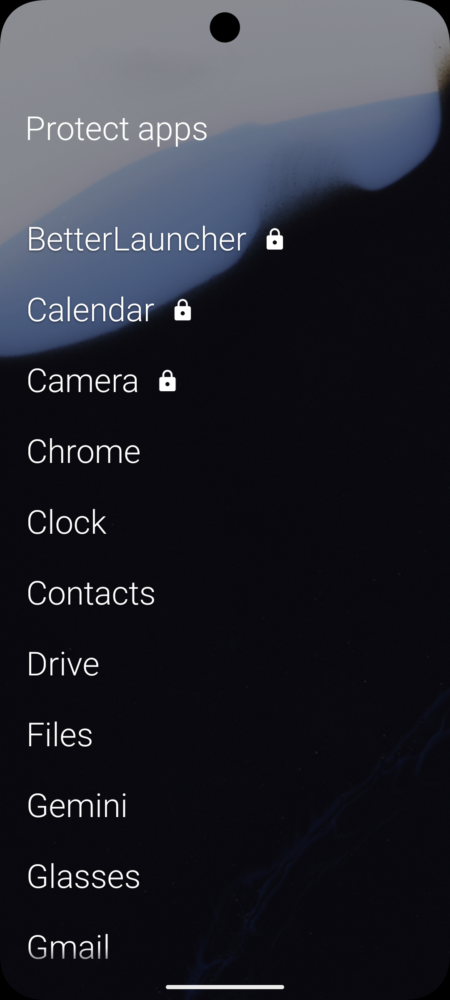

# BetterLauncher

Hard fork of [Olauncher](https://github.com/tanujnotes/olauncher) featuring additional customizations, a polished UI/UX, and a clean, popup-free experience.

## Added Features
- **Favorite App Shortcuts & Icons:** Add a row of customizable icons to your home screen, allowing you to custom-assign both the visual icon and the application that is opened.
- **Home Screen Widget Support:** Easily place and configure a system widget directly on your home screen.
- **App Folders & Groups:** Organize your application drawer or home screen apps into custom, easily accessible folders/groups.
- **Secure App Locking:** Protect sensitive applications using native device lock options (PIN, pattern, password, or biometrics).

## Improvements
- **Enhanced Readability:** Refined typography and layout contrast to make the user interface much easier to read.
- **Improved Usability:** Redesigned toggle switches and buttons for a smoother, more intuitive navigation experience in settings.
- **Popup-Free Experience:** Removed intrusive popups and prompts (such as premium version reminders).
- **Polished UX:** Various fine-tunings and bug fixes to provide an overall cleaner, faster, and more polished feel.

## Visual Showcase

### BetterLauncher vs. Olauncher
BetterLauncher offers a highly customizable, feature-rich interface compared to the original launcher, while maintaining a clean aesthetic.

#### BetterLauncher (Home Screen & Settings)

#### Olauncher (Original Home Screen & Settings)

---

### Home Screen Widget Support
You can easily select and place any standard system widget directly on your home screen.

  
  &nbsp;&nbsp;&nbsp;&nbsp;
  

---

### Secure App Locking
Protect sensitive applications using your device's native lock credentials.

  

<!---->

### Install using 
<!--[F-Droid](https://f-droid.org/packages/app.olauncher),-->
[Play Store](https://play.google.com/store/apps/details?id=app.olauncher) or the [latest APK](https://github.com/pierspad/BetterLauncher/releases/).

## List of changes

### Added Features
- **Favorite App Shortcuts & Icons:** Add a row of customizable icons to your home screen, allowing you to custom-assign both the visual icon and the application that is opened.
- **Home Screen Widget Support:** Easily place and configure a system widget directly on your home screen.
- **App Folders & Groups:** Organize your application drawer or home screen apps into custom, easily accessible folders/groups.
- **Secure App Locking:** Protect sensitive applications using native device lock options (PIN, pattern, password, or biometrics).

### Improvements
- **Enhanced Readability:** Refined typography and layout contrast to make the user interface much easier to read.
- **Improved Usability:** Redesigned toggle switches and buttons for a smoother, more intuitive navigation experience in settings.
- **Popup-Free Experience:** Removed intrusive popups and prompts (such as premium version reminders).
- **Polished UX:** Various fine-tunings and bug fixes to provide an overall cleaner, faster, and more polished feel.

License: [GNU GPLv3](https://www.gnu.org/licenses/gpl-3.0.en.html)

Personal website: [pierspad.com](https://www.pierspad.com)
