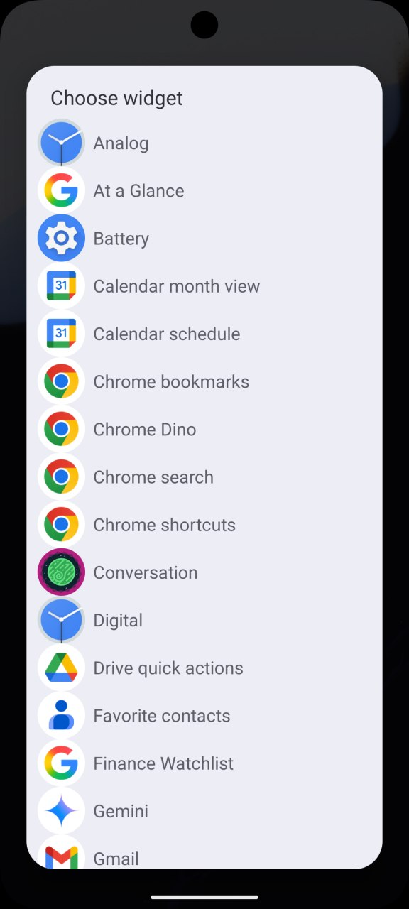
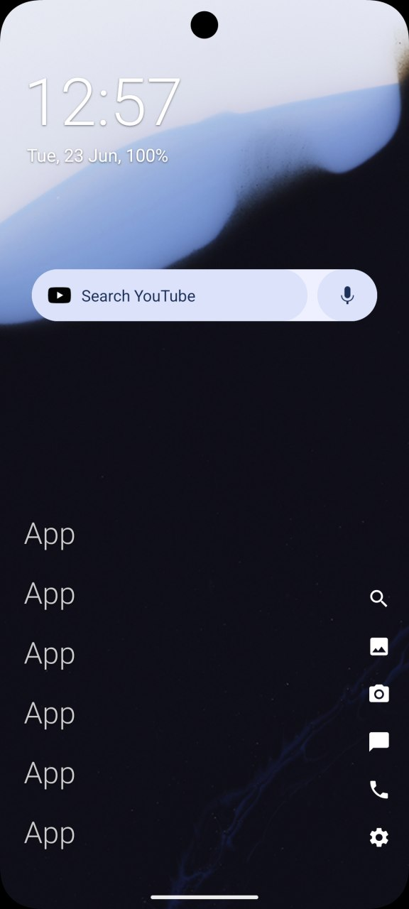

# BetterLauncher

Hard fork of [Olauncher](https://github.com/tanujnotes/olauncher) featuring additional customizations, a polished UI/UX, and a clean, popup-free experience.

### BetterLauncher vs. Olauncher

#### BetterLauncher (Home Screen & Settings)

#### Olauncher (Original Home Screen & Settings)

<!---->

### Install using 
<!--[F-Droid](https://f-droid.org/packages/app.olauncher),-->
[Play Store](https://play.google.com/store/apps/details?id=app.olauncher) or the [latest APK](https://github.com/pierspad/BetterLauncher/releases/).

## Added Features
- **Favorite App Shortcuts & Icons:** Add a row of customizable icons to your home screen, allowing you to custom-assign both the visual icon and the application that is opened.
- **Home Screen Widget Support:** Easily place and configure a system widget directly on your home screen.
- **App Folders & Groups:** Organize your application drawer or home screen apps into custom, easily accessible folders/groups.
- **Secure App Locking:** Protect sensitive applications using native device lock options (PIN, pattern, password, or biometrics).
- **App Usage Limits:** Set a cooldown on distracting apps — opening one too soon starts an escalating timer, while leaving it alone lets the cooldown decay back down.
- **Smarter Drawer Search:** Fuzzy, typo-tolerant app matching, plus the ability to search and jump straight to contacts and Android system settings (Wi-Fi, Bluetooth, display, and more) without leaving the drawer.
- **Drag-to-Reorder:** Reorder home screen apps and shortcut icons with a direct drag gesture instead of a separate dialog.
- **Custom Fonts & In-App Language:** Apply a custom font — a built-in family or your own imported .ttf/.otf — across the whole UI, and set the launcher's language independently of the system's.
- **Settings Backup & Restore:** Export your full configuration to a file or the clipboard, and import it again later or on another device.
- **Monochrome Icon Pack:** Switch between the original colorful app icons and a unified monochrome set (via Lawnicons) for a more consistent look.

## Improvements
- **Enhanced Readability:** Refined typography and layout contrast, with shortcut icons that scale alongside your chosen text size, for a clearer interface.
- **Improved Usability:** Redesigned toggle switches, segmented alignment controls, and SeekBar-based sizing pickers for smoother navigation in settings.
- **Live Wallpaper Preview:** See your actual wallpaper through the settings panel while adjusting background opacity, with a smooth transition instead of a hard cut.
- **More Reliable Widgets:** Widget placement is validated to avoid dead or broken widgets, without the system picker getting in the way.
- **Popup-Free Experience:** Removed intrusive popups and prompts (such as premium version reminders) and advertising banners.
- **Polished UX:** Visual indicators for locked apps and groups in the drawer, one-tap theme cycling, a settings reset option, and various fine-tunings and bug fixes for an overall cleaner, faster feel.

### Home Screen Widget Support
You can easily select and place any standard system widget directly on your home screen.

  
  &nbsp;&nbsp;&nbsp;&nbsp;
  

### Secure App Locking
Protect sensitive applications using your device's native lock credentials.

  

License: [GNU GPLv3](https://www.gnu.org/licenses/gpl-3.0.en.html)

Personal website: [pierspad.com](https://www.pierspad.com)
